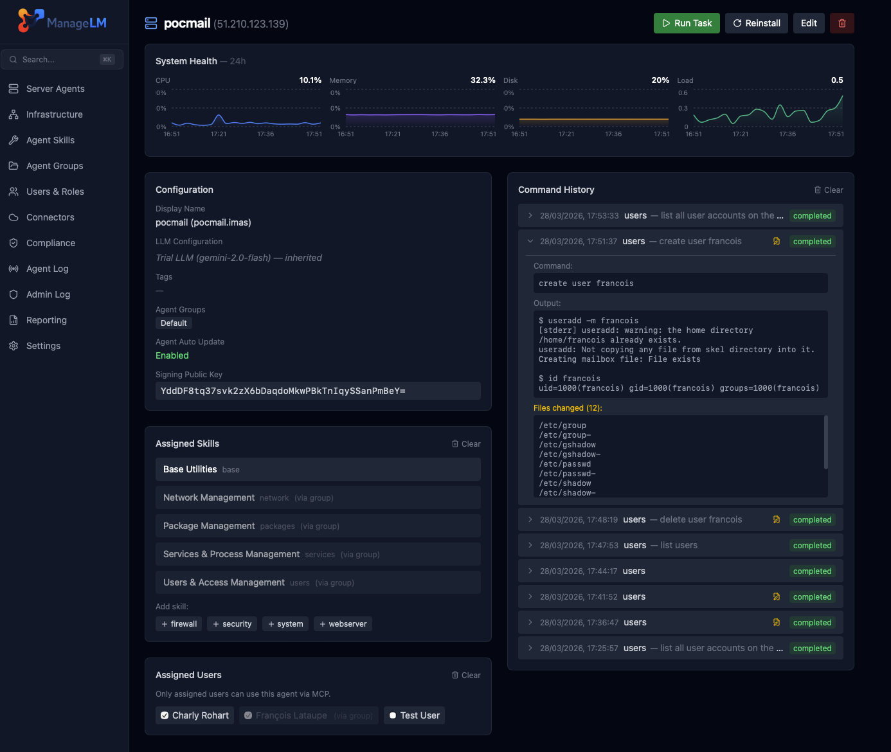
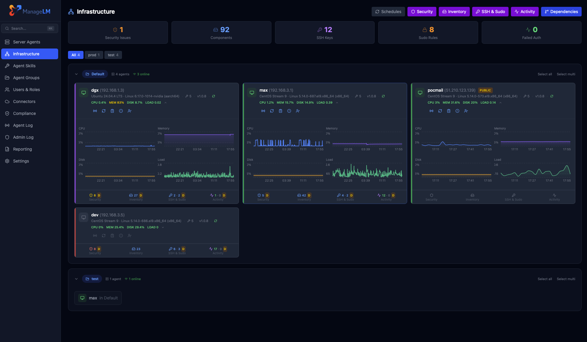

<p align="center">
  <a href="https://www.managelm.com">
    
  </a>
</p>

<h3 align="center">ManageLM Agent</h3>

<p align="center">
  Manage Linux &amp; Windows servers with natural language — from the cloud or directly on the machine.
</p>

<p align="center">
  <a href="LICENSE"></a>
  <a href="https://www.managelm.com"></a>
  <a href="https://app.managelm.com/doc/"></a>
  
  
</p>

<p align="center">
  
</p>

---
  
The ManageLM Agent is a lightweight Python daemon that runs on your Linux servers. Describe what you need in natural language — the agent uses a local or cloud LLM to interpret and execute operations securely.
  
```
managelm> install nginx, enable it, and open port 443
  
  Execution Plan
  ┌──────────────────────────────────────────────────────┐
  │  1) packages skill  →  Install nginx                 │
  │  2) services skill  →  Enable and start nginx        │
  │  3) firewall skill  →  Open port 443/tcp             │
  └──────────────────────────────────────────────────────┘
  
  1)  packages:  Install nginx
     $ dnf install -y nginx
     ✓ Installed nginx 1.26.2
     
  2)  services:  Enable and start nginx
     $ systemctl enable --now nginx
     ✓ nginx is active and enabled
     
  3)  firewall:  Open port 443/tcp
     $ firewall-cmd --permanent --add-service=https && firewall-cmd --reload
     ✓ HTTPS (443/tcp) opened in firewalld
     
  ────────────────────────────────────────────
  ✓ All steps completed.
```

## Features

- **Natural language** — Just say what you need. The agent picks the right skill and runs the right commands.
- **Multi-step planner** — Complex requests are automatically decomposed across skills (e.g. "install nginx and open port 443" becomes a packages step + a firewall step).
- **32 built-in skills** — Packages, services, firewall, web servers, databases, containers, certificates, users, storage, and more.
- **Local LLM** — Task interpretation happens on the server via Ollama, LocalAI, or any OpenAI-compatible endpoint. Cloud LLM providers also supported.
- **Interactive shell** — `managelm-shell` gives you a natural-language terminal directly on the server.
- **Cloud portal** — Manage fleets from [app.managelm.com](https://app.managelm.com) or via the Claude MCP integration.
- **Outbound-only** — The agent connects to the portal. No inbound ports required.
- **Read-only by default** — Empty `allowed_commands` = read-only. You control exactly what each agent can do.
- **4-layer security** — Injection blocking, binary allowlist, destructive argument guard, and kernel sandbox (Landlock + seccomp-bpf).
  
## Quick Start
  
### 1. Get an access token
  
Sign up at [app.managelm.com](https://app.managelm.com) (or your self-hosted portal) and create an agent — you'll get an access token.

### 2. Install the agent
     
```bash
curl -fsSL https://app.managelm.com/install | bash
```
     
The installer prompts for your portal URL, email, and server group — then enrolls the agent automatically. Only requirement: **Python 3.9+**.
  
### 3. Start using it

**From the portal:**
Open [app.managelm.com](https://app.managelm.com), select your server, and type a task. Or use the Claude MCP integration to manage servers from Claude Desktop.

**From the server itself:**
```bash
managelm-shell
```

## ManageLM Shell

The shell is an interactive natural-language terminal that runs directly on your managed servers. It connects to the agent daemon over a Unix socket — same security pipeline, same sandboxing, zero network dependency.

```
$ managelm-shell

ManageLM Shell — server.example.com
Skills: firewall, packages, services, webserver
Type what you need in natural language. Ctrl+D to quit.
  
managelm>
```
  
### Just type what you need

The agent auto-selects the right skill:

```
managelm> check disk usage
  [base] ✓ Root filesystem: 42% used (18G of 40G). /var is 67% used.

managelm> install htop
  [packages] ✓ Installed htop 3.3.0

managelm> restart nginx
  [services] ✓ nginx restarted successfully.

managelm> open port 8080
  [firewall] ✓ Opened 8080/tcp in firewalld.
```

## Fleet Management

<p align="center">
  
</p>

Manage your entire fleet from the [cloud portal](https://app.managelm.com) or through AI integrations. Monitor health, run tasks across groups, trigger security audits, and track changes — all from a single pane.

## Integrations

The agent works with your favorite AI tools:

- [Claude Code Extension](https://github.com/managelm/claude-extension) — MCP integration for Claude
- [VS Code Extension](https://github.com/managelm/vscode-extension) — `@managelm` in Copilot Chat
- [ChatGPT Plugin](https://github.com/managelm/openai-gpt) — manage servers from ChatGPT
- [n8n Plugin](https://github.com/managelm/n8n-plugin) — infrastructure automation workflows
- [Slack Plugin](https://github.com/managelm/slack-plugin) — notifications and commands in Slack
- [OpenClaw Plugin](https://github.com/managelm/openclaw-plugin) — OpenClaw integration

## Links

- [Website](https://www.managelm.com)
- [Cloud Portal](https://app.managelm.com)
- [Documentation](https://app.managelm.com/doc/)

## License

[Apache 2.0](LICENSE)
